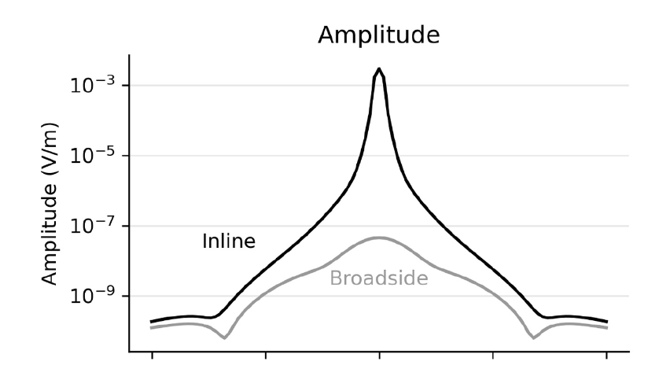

# Towards an open-source landscape for 3-D CSEM modelling

_Dieter Werthmüller, Raphael Rochlitz, Octavio Castillo-Reyes and Lindsey J. Heagy_

https://doi.org/10.1093/gji/ggab238



## Summary

Large-scale modelling of 3-D controlled-source electromagnetic (CSEM) surveys used to be feasible only for large companies and research consortia. This has changed over the last few years, and today there exists a selection of different open-source codes available to everyone. Using four different codes in the Python ecosystem, we perform simulations for increasingly complex models in a shallow marine setting. We first verify the computed fields with semi-analytical solutions for a simple layered model. Then we validate the responses of a more complex block model by comparing results obtained from each code. Finally, we compare the responses of a real-world model with results from the industry. On the one hand, these validations show that the open-source codes are able to compute comparable CSEM responses for challenging, large-scale models. On the other hand, they show many general and method-dependent problems that need to be faced for obtaining accurate results. Our comparison includes finite-element and finite-volume codes using structured rectilinear and octree meshes as well as unstructured tetrahedral meshes. Accurate responses can be obtained independently of the chosen method and the chosen mesh type. The runtime and memory requirements vary greatly based on the choice of iterative or direct solvers. However, we have found that much more time was spent on designing the mesh and setting up the simulations than running the actual computation. The challenging task is, irrespective of the chosen code, to appropriately discretize the model. We provide three models, each with their corresponding discretization and responses of four codes, which can be used for validation of new and existing codes. The collaboration of four code maintainers trying to achieve the same task brought in the end all four codes a significant step further. This includes improved meshing and interpolation capabilities, resulting in shorter runtimes for the same accuracy. We hope that these results may be useful for the CSEM community at large and that we can build over time a suite of benchmarks that will help to increase the confidence in existing and new 3-D CSEM codes.


## Citation

Dieter Werthmüller, Raphael Rochlitz, Octavio Castillo-Reyes, Lindsey Heagy, Towards an open-source landscape for 3-D CSEM modelling, Geophysical Journal International, Volume 227, Issue 1, October 2021, Pages 644–659, https://doi.org/10.1093/gji/ggab238

```
@article{werthmüller_modelling_2021,
    author = {Werthmüller, Dieter and Rochlitz, Raphael and Castillo-Reyes, Octavio and Heagy, Lindsey},
    title = "{Towards an open-source landscape for 3-D CSEM modelling}",
    journal = {Geophysical Journal International},
    volume = {227},
    number = {1},
    pages = {644-659},
    year = {2021},
    month = {06},
    issn = {0956-540X},
    doi = {10.1093/gji/ggab238},
    url = {https://doi.org/10.1093/gji/ggab238},
    eprint = {https://academic.oup.com/gji/article-pdf/227/1/644/38915943/ggab238.pdf}
}
```
